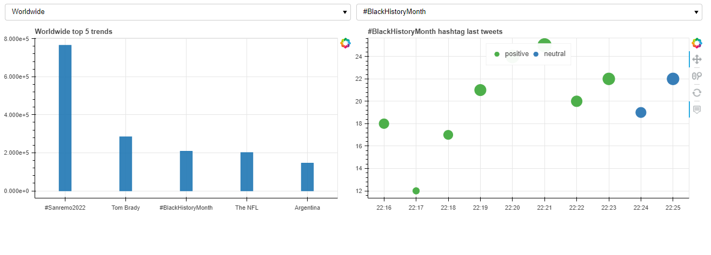

# Twitter Data Visualisation  and Graph Analytics


# Introduction
This project is composed of two main parts. First, we will focus on visualization.
Our goal in this part is to build a dashboard (with [bokeh](https://bokeh.org/)) that will allow the visualization of trend data from Twitter.  In the following, we will use the ETL approach for data acquisition.

In a second time we will focus on graph analysis.
The description of this part is in the notebook [graph_analytics.ipynb](notebooks/graph_analytics.ipynb) associated to this project.

In order to be able to follow our project and test it we invite you to install the necessary libraries mentioned in the file [requirements.txt](requirements.txt).To do so, you just have to run the following command.

```bash
pip3 install . -r requirements.txt
```

# Twitter Data Visualisation


## Extraction and Transformation
Instead of using the twitter API with the python library [tweepy](https://docs.tweepy.org/en/stable/) we will use the library [twint](https://github.com/twintproject/twint)

As we don't use the official twitter library, we used the website [trendstwitter.com](https://trendstwitter.com/) to get the list of countries with trends and the list of respective trends.
Thanks to the python library [beautifulsoup](https://pypi.org/project/beautifulsoup4/) we scrap this site.

Regarding the data collection associated to the tweets, we use as mentioned above the library [twint](https://github.com/twintproject/twint)

In order to make our work easier we made our code modular so the file [scraper.py](models/scraper.py) contains all the necessary functions for the scrapping. You will find below the code contained in this file.


```python
from bs4 import BeautifulSoup
import requests
import twint
import nest_asyncio
nest_asyncio.apply()
import pandas as pd


def format_country_name(country:str):
    '''
    feed with a country name and return formated country name 
    eg. United State -> united-state
    '''
    return country.replace(" ","-").lower()


def get_countries():
    '''
    using beautifull soup and scrap https://trendstwitter.com/ and look for available countries in trends list
    '''
    url = 'https://trendstwitter.com/'

    html_text= requests.get(url=url).content
    soup=BeautifulSoup(html_text,"html.parser")
    countries_h5=soup.find_all('h5',class_='location-menu__country-header')
    countries_list=[]
    for country in countries_h5:
        countries_list.append(country.text)
    countries_list[0]='Worldwide'
    return countries_list


def get_trends(country:str):
    '''
    feed with country name and return this countrie trending topics
    '''
    if country.lower()=='worldwide':
        country=''
    country=format_country_name(country)
    url = 'https://trendstwitter.com/'+country

    html_text= requests.get(url=url).content
    soup=BeautifulSoup(html_text,"html.parser")
    tends_li=soup.find('ol',class_='trend-card__list').find_all('li')
    df=pd.DataFrame(columns=["trends","links","volumes"])
    for li in tends_li:
        tends_data={}
        volume=li.find('div',class_="oltweets")
        if volume is None:
            tends_data["volumes"]=0
        else:
            tends_data["volumes"]=int(volume.text.split()[0])
        tends_data["links"]=li.find('a')['href']
        tends_data["trends"]=li.find('a').text
        df=pd.concat([df,pd.DataFrame(tends_data,index={1})],ignore_index=True)

    return df.sort_values(by=['volumes'], ascending=False)


def fetch_tweets(hachtag:str):
    '''
    feed with a topic string and retrun 200 last tweet data about this topic
    '''
    config = twint.Config()
    columns=['conversation_id', 'date', 'language', 'username', 'tweet','nretweets', 'nlikes', 'hashtags']
    config.Limit=200
    config.Hide_output = True
    config.Search = hachtag
    config.Pandas=True
    twint.run.Search(config)
    df=twint.storage.panda.Tweets_df[columns]
    return df


def find_common_trends(trends_1:list,trends_2:list):
    '''
    feed with two list of topics and return common elements in these list
    '''
    common= [trend for trend in trends_1 if trend in trends_2]
    return common
```

## Loading and visualisation
Once the scrapping functions have been defined, all we have to do is load the data and visualize it. For that we use [bokeh server](https://bokeh.org/) which allows us to create interactive graphs. As for the scrapping part we have grouped the functions of creation of the dashboard in the file [bokeh_dviz.py](bokeh_dviz.py) whose content is the following.

```python
# importing bokeh libraries for visualisation
import pandas as pd
from statistics import mode
from bokeh.plotting import figure
from bokeh.io import curdoc
from bokeh.layouts import column,row
from bokeh.models import ColumnDataSource,Select
from bokeh.models.tools import HoverTool
from bokeh.transform import factor_cmap


# import our scraping module
from models.scraper import get_countries,get_trends,fetch_tweets
# import our sentiment analysis module
from models.sentiment_analysis import get_tweet_sentiment


# Funtions

def hourconversion(s):
    '''
    feed with %h:%m:%s format and returning %h:%m
    '''
    s= s.split(":")
    return f'{s[0]}:{s[1]}'


def get_tweet_plot_data(df):
    '''
    feed with tweet raw data and return displayable data after calculation of count statistics
    @ntweet,@tweet_time,@username,
    '''
    tweet_data=df
    tweet_data["hour"]=tweet_data["date"].apply(lambda x: hourconversion(x.split(" ")[1]))
    tweet_data["sentiment"]=tweet_data["tweet"].apply(get_tweet_sentiment)
    ntweet=list(tweet_data.groupby("hour")["conversation_id"].count())
    tweet_time=list(tweet_data.groupby("hour")["conversation_id"].count().index)
    usernames=list(tweet_data.groupby("hour").aggregate({"username":list})["username"])
    sentiment=list(tweet_data.groupby("hour").aggregate({"sentiment":mode})["sentiment"])
    df = pd.DataFrame(list(zip(ntweet,tweet_time,usernames,sentiment)), columns=['ntweet','tweet_time','username','sentiment'])
    return df


def get_trend_ticker(trends):
    '''
    feed with bookeh trends data source and returning trends select widget
    '''
    ticker=Select(value=list(trends.data["trends"])[0],options=list(trends.data["trends"]))
    return ticker


def top_trends_plot(trends):
    '''
    feed with bookeh trends data source and returning trends top 5 barplot 
    this function only plot the data
    '''
    fig= figure(x_range=trends.data['trends'][:5],width=650,height=350,tools=[])
    fig.vbar(x="trends", top="volumes", width=0.2,fill_alpha = 0.9,source=trends)
    fig.title=f"{countries_ticker.value} top 5 trends"
    return fig


def tweet_data_plot(tweet):
    '''
    feed with tweet plot data source and returning last conseration count plot
    this function only plot the data
    '''
    sentiment=["negative","neutral","positive"]
    
    fig=figure(x_range=tweet.data['tweet_time'],width=650,height=350,tools=['wheel_zoom','reset','pan'])
    fig.circle(x="tweet_time", y="ntweet", size='ntweet',color=factor_cmap('sentiment', 'Set1_3', sentiment),legend_field='sentiment',source=tweet)
    fig.title=f'{trends_ticker.value} hashtag last tweets'
    fig.legend.orientation = "horizontal"
    fig.legend.location = "top_center"

    hover.tooltips=[
    ('users', '@username'),
    ('volume','@ntweet'),
    ('time', '@tweet_time'),
    ('sentiment', '@sentiment'),
    ]
    fig.add_tools(hover)

    return fig


# tichers update callbacks
def country_ticker_update(attrname, old, new):
    '''
    updating countries select widget option and rerendering the dashboard
    '''
    trends_data=get_trends(country=countries_ticker.value)
    trends_source.data=trends_data
    trends_ticker.options=list(trends_source.data["trends"])
    trends_ticker.value=list(trends_source.data["trends"])[0]
    doc.clear() # here we clear the dashboard
    doc.add_root(draw_layout())
    
    
def trend_ticker_update(attrname, old, new):
    '''
    updating trends select widget option and rerendering the dashboard
    '''
    tweet_data= fetch_tweets(hachtag=trends_ticker.value)
    tweets_source.data= get_tweet_plot_data(tweet_data)
    doc.clear()# here we clear the dashboard
    doc.add_root(draw_layout())


# layout drawer
def draw_layout():
    '''
    this function just layout the dashboard elements and return a bokeh dashboard widget
    '''
    world_plots= column(countries_ticker,top_trends_plot(trends_source))
    trend_plot= column(trends_ticker,tweet_data_plot(tweets_source))
    dashboard= row(world_plots,trend_plot)
    return dashboard


#_______________________________#


doc=curdoc()
doc.title="Twitter trends Visualisation"

hover = HoverTool()

waiting_img = figure(tools=[])
waiting_img.image_url(url='../src/images/waiting.png',x=[0], y=[0], w=[1], h=[1], anchor="bottom_left")

    
# Variables
countries= get_countries()

# widgets
countries_ticker=Select(value=countries[0],options=countries) # here we create the first instante of countries selection widget
trends_data=get_trends(country=countries_ticker.value)
trends_source=ColumnDataSource(data=trends_data) # convert de dataframe into bokeh source data for the ease of use
trends_ticker=get_trend_ticker(trends_source)

tweets_data= fetch_tweets(hachtag=trends_ticker.value)
tweets_source= ColumnDataSource(data=get_tweet_plot_data(tweets_data)) 


#on change
countries_ticker.on_change('value',country_ticker_update) # calling callback to udate the whole page 
trends_ticker.on_change('value',trend_ticker_update)


# bokeh server
doc.add_root(draw_layout())

```

It is also important to note that we have added a sentiment analysis module that allows you to have an idea of the general sentiment of the hashtag when viewing the dashboard. Our sentiment module is located in the file [sentiment_analysis.py](models/sentiment_analysis.py). You will find the associated code below.

```python
import re
from textblob import TextBlob

def clean_tweet(tweet:str):
    '''
    Utility function to clean tweet text by removing links, special characters
    using simple regex statements.
    '''
    return ' '.join(re.sub("(@[A-Za-z0-9]+)|([^0-9A-Za-z \t])|(\w+:\/\/\S+)", " ", tweet).split())


def get_tweet_sentiment(tweet:str):
    '''
    Utility function to classify sentiment of passed tweet
    using textblob's sentiment method
    '''
    # create TextBlob object of passed tweet text
    analysis = TextBlob(clean_tweet(tweet))
    # set sentiment
    if analysis.sentiment.polarity > 0:
        return 'positive'
    elif analysis.sentiment.polarity == 0:
        return 'neutral'
    else:
        return 'negative'
```
## Hands-on experience 

Now we come to the most fun part of this document: the handling of our dashboard, which looks like this 


We have basically two drop-down menus that allow us to manipulate the dashboard. From right to left (**1** and **2**).

The first one allows you to select a country from the list of available countries and the second one allows you to select a hashtag from the available hashtags for the selected country
> the hashtags are sorted in ascending order of their volume


Regarding the plots, the one on the right shows the top 5 trends of the selected country and the one on the left shows the count of the last tweets associated to the selected hashtag ordered by minutes
Also the color of the bubbles on the left informs us about the **feeling** of these tweets :

>* The <span style="color:green">green</span> for positive sentiment
>* The <span style="color:blue">blue </span> for neutral sentiment
>* The <span style="color:red">red</span> for negative sentiment 

Moreover, by placing the mouse pointer on a bubble we get the information associated with it:
>* the list of users who have made tweets at this precise moment
>* the number of tweets made at this moment
>* the moment itself
>* The general feeling of the bubble
>

>**One last thing:** it is important to know that the dashboard works in real time. So at **each selection** it takes approximately **6 seconds** to get the data from our scraping module [scraper.py](models/scraper.py) and generate the plots. Time taken is associated with the scraping process. To launch the dashboard, simply run the following command

```bash
bokeh serve --show bokeh_dviz.py
```


ENJOY !!!
# Twitter Data Graph Analytics
[graph_analytics.ipynb](notebooks/graph_analytics.ipynb) or 
[graph_analytics.html](graph_analytics.html)
